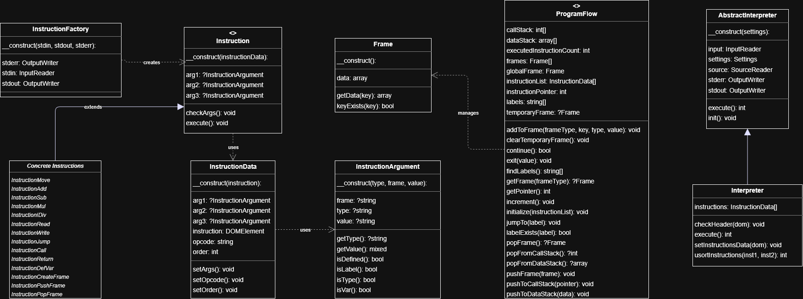

# IPPCode24 Interpreter

**Author:** Michal Balogh
**Login:** xbalog06
**Course:** IPP 2023/2024

This project implements an interpreter for the IPPCode24 language in PHP, following object-oriented programming principles and using modern development tools. (My implementation is in the `student/` directory.)

## Project Overview

The IPPCode24 Interpreter is a command-line tool that reads XML-formatted IPPCode24 source code and executes it. The interpreter processes instructions sequentially, managing program flow, variables, and data frames according to the IPPCode24 language specification.

## Project Structure

```
.
├── core/                           # Core framework classes (do not modify)
│   ├── AbstractInterpreter.php     # Base interpreter class
│   ├── Engine.php                  # Main execution engine
│   ├── FileInputReader.php         # File input handling
│   ├── FileSourceReader.php        # Source file reading
│   ├── ReturnCode.php              # Exit codes
│   ├── Settings.php                # Configuration
│   ├── StreamWriter.php            # Output handling
│   ├── Exception/                  # Core exceptions
│   └── Interface/                  # Core interfaces
├── student/                        # Student implementation
│   ├── Frame.php                   # Data frame management
│   ├── Instruction.php             # Base instruction class
│   ├── InstructionArgument.php     # Instruction argument handling
│   ├── InstructionData.php         # Instruction data management
│   ├── InstructionFactory.php      # Instruction creation
│   ├── Interpreter.php             # Main interpreter implementation
│   ├── ProgramFlow.php             # Program flow control
│   ├── Exception/                  # Student exceptions
│   ├── Types/                      # Data type implementations
│   └── classDiagram.png           # Class diagram
├── interpret.php                   # Main entry point
├── composer.json                   # Dependencies and autoloading
├── phpstan.neon                   # Static analysis configuration
└── prog*.xml                      # Sample IPPCode24 programs
```

## Architecture

### Core Components

- **Interpreter:** Main interpreter class that extends AbstractInterpreter, handles XML parsing and instruction execution
- **InstructionFactory:** Creates instruction instances based on operation codes
- **Frame:** Manages variable storage and scoping
- **ProgramFlow:** Handles program counter and flow control

### Instruction Processing

- **Instruction:** Abstract base class for all instructions with execute() method
- **InstructionData:** Stores instruction data extracted from XML
- **InstructionArgument:** Handles instruction arguments with type checking and validation

## Class Diagram



## Usage

Run the interpreter with an IPPCode24 XML file:

```bash
php interpret.php --source=program.xml
```

For help and available options:

```bash
php interpret.php --help
```

## Development Setup

### Prerequisites

- PHP 8.3 or higher
- Composer (included as composer.phar)

### Installation

Install dependencies:

```bash
php composer.phar install
```

Run static analysis:

```bash
vendor/bin/phpstan
```

### Development Environment Options

#### Option 1: Development Container (Recommended)

1. Open project in VS Code
2. Use "Dev Containers: Reopen in Container" command
3. All tools and extensions will be automatically configured

#### Option 2: Merlin Server

- Use VS Code 1.85 or older for remote development
- Install dependencies: `php8.3 composer.phar install`
- Run with: `php8.3 interpret.php --help`

#### Option 3: Local Setup

- Install PHP 8.3+ locally
- Ensure compatibility with Merlin server configuration

### Development Tools

- **Composer:** Dependency management and PSR-4 autoloading
- **PHPStan:** Static code analysis with strict type checking
- **VS Code Extensions:** PHP Intelephense, PHP Debug, Code Spell Checker

## Testing

Sample IPPCode24 programs are provided as `prog1.xml`, `prog2.xml`, and `prog3.xml`.

## Code Quality

The project follows:

- PSR-4 autoloading standards
- Strict type checking with PHPStan
- Object-oriented design principles
- Comprehensive error handling

