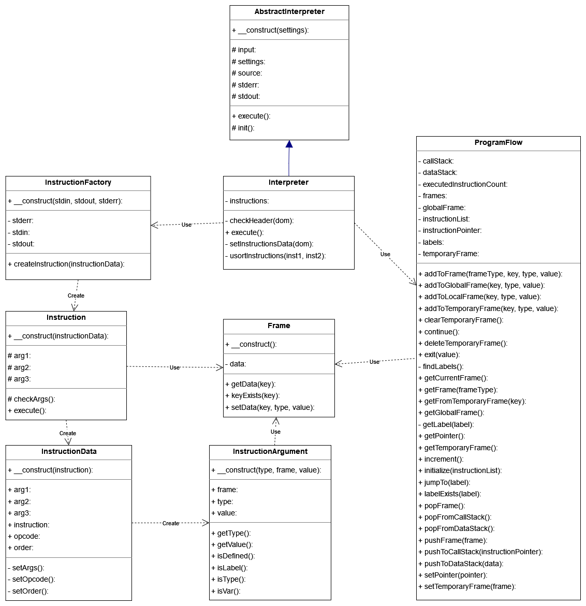

# Interpret pre jazyk IPPCode24

**Implementačná dokumentácia k 2. úlohe do IPP 2023/2024**\
**Meno a priezvisko: Michal Balogh**\
**Login: xbalog06**

## Implementácia
Implementácia interpretu pre jazyk IPPCode24 je rozdelená do niekoľkých tried, ktoré spolu spolupracujú. 

## Interpreter
Interpretacia vstupneho kodu zacina v triede `Interpreter`, ktora implememtuje abstraktnu triedu `AbstractInterpreter`. Trieda `Interpreter` vyuziva na nacitanie zdrojoveho XML kodu metody zdedene z funkcie `AbstractInterpret`. Po nacitani zdrojoveho kodu sa invokuju metody `checkHeader()` na skontrolovanie hlavicky zdrojoveho kodu a `InstructionsData` ktora extrahuje instrukcie a ich argumenty z XML kodu.
Potom sa inicializuje trieda `InstructionFactory`, ktora vytvara instancie instrukcii podla operacneho kodu danej instrukcie. Nasledne sa vykonava interpretacia instrukcii pomocou metody `execute()`.

## ProgramFlow
ProgramFlow je staticka trieda, ktora obsahuje rozne metody na manipulaciu s instrukciami, pracovanie s ramcami a zasobnikom. Trieda obsahuje metody na posuvanie sa na dalsiu instrukciu alebo na skoky, vytvorenie a zrusenie ramcov, pridanie, odobranie alebo ziskanie hodnot z ramcov a zasobniku. 

## InstructionFactory 
Trieda `InstructionFactory` predstavuje navrhovy vzor **Factory**, ktory rozhoduje ktoru instanciu instrukcii vytvorit na zaklade operacneho kodu danej instrukcie. Trieda obsahuje metodu `createInstruction()`, ktora prijma data instrukcie a na zaklade operacneho kodu danej instrukcie vytvara instanciu instrukcie. 

## Instruction
Trieda `Instruction` je abstraktna trieda ktoru implementuju vsetky instrukcie. Trieda obsahuje metodu `execute()`, ktora vykonava danu instrukciu. Okrem toho este obsahuje metodu `checkArguments()`, ktora uz je implementovana a kontroluje, ci su argumenty definovane v danom ramci. 

## InstructionsData
Trieda `InstructionsData` sluzi na uchovavanie dat instrukcii. Na uchovanie jednotlivych argumentov instrukcii sluzi trieda `InstructionArgument`.

## InstructionArgument
Trieda `InstructionArgument` sluzi na uchovavanie argumentov instrukcii. Obsahuje taktiez metodu na kontrolu typu argumentu, ziskanie typu a hodnoty argumentu. Okrem toho obsahuje metodu na kontrolu, ci je hodnota argumentu definovana v danom ramci.

## Frame
Trieda `Frame` sluzi na uchovavanie dat ramcov. Obsahuje metody na pridanie a ziskanie hodnot z ramcov a kontrolu, ci je hodnota definovana v danom ramci.

## Diagram tried
V nasledujucom diagrame tried je zobrazena struktura tried a ich vztahy. Pre prehladnost su vynechane jednotlive instrukcie, ktore vsetky implementuju abstraktnu triedu `Instruction` a maju len inu metodu `execute()`.
